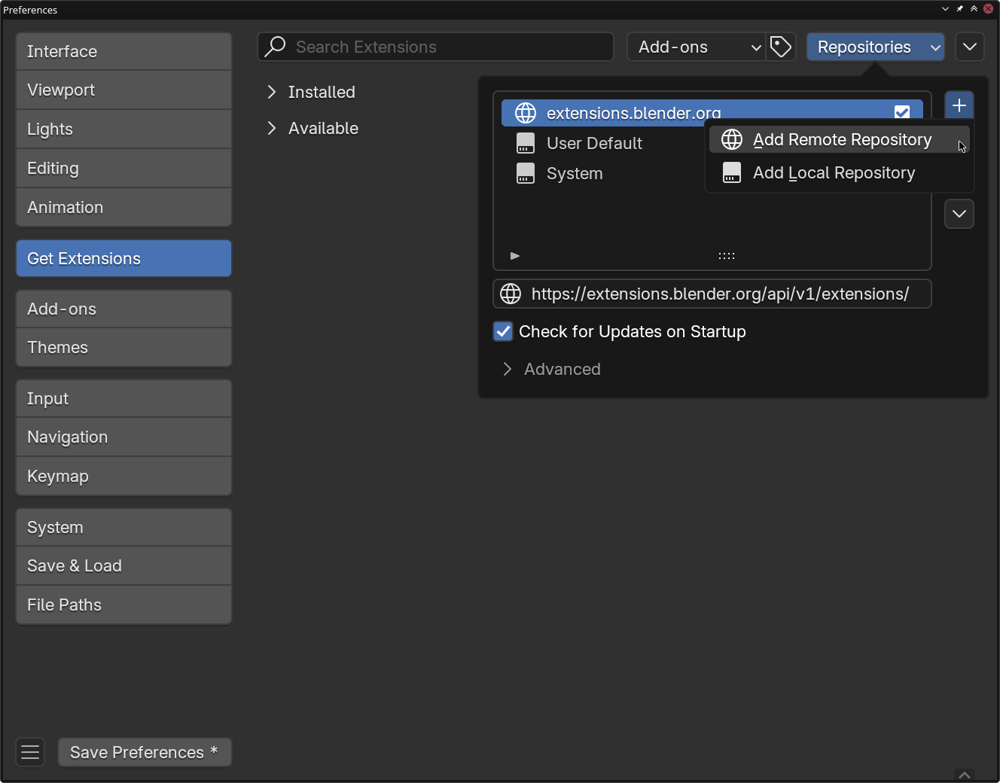
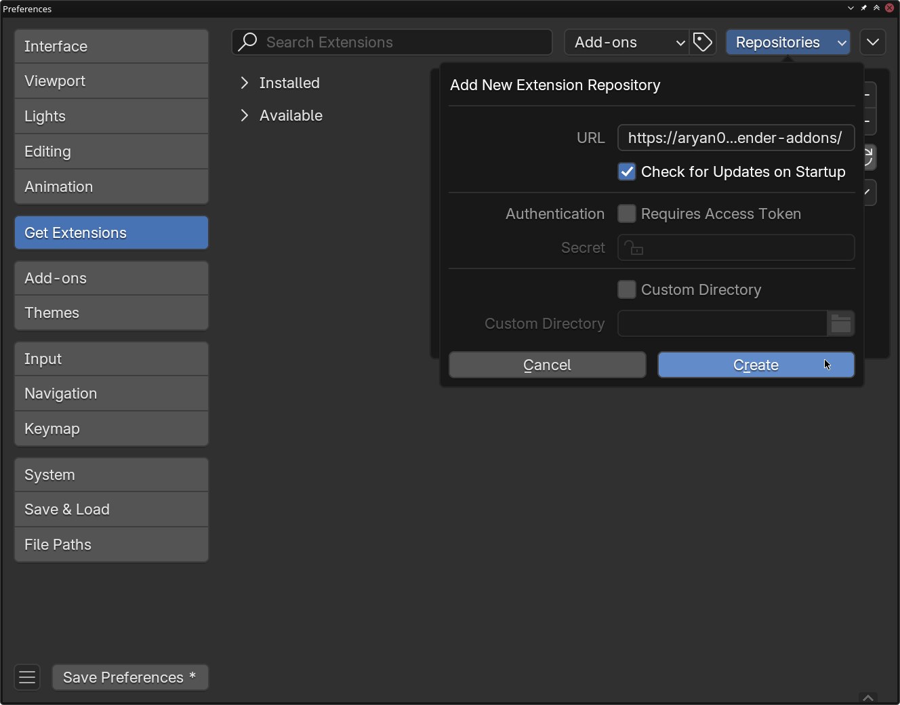
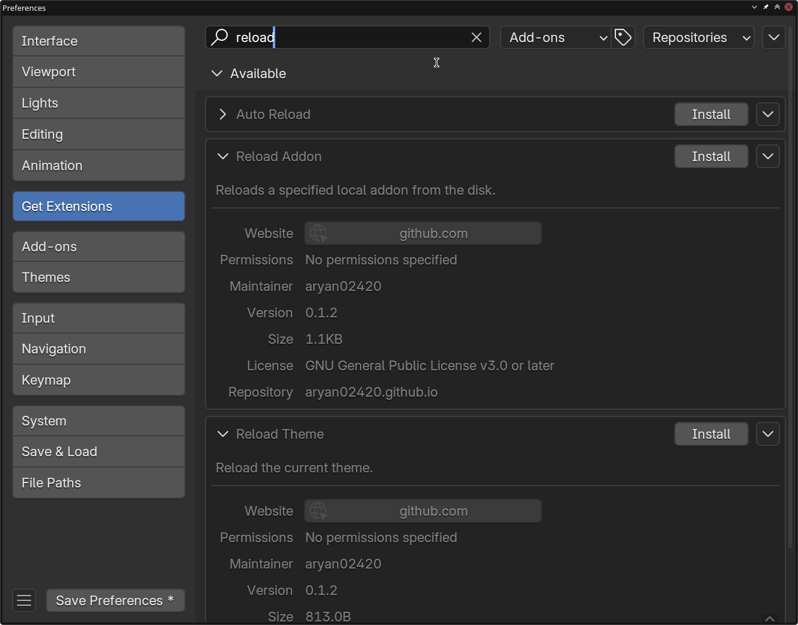
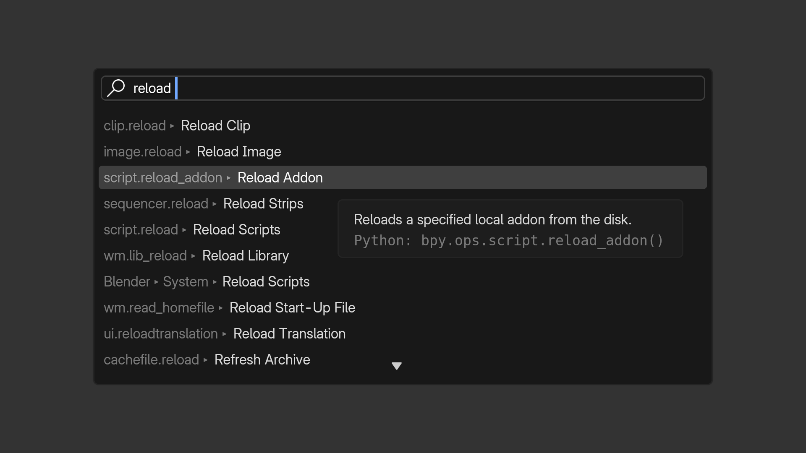

# blender-addons

## Installation

Some of the addons here are available on the official [Blender extensions registry](https://extensions.blender.org/). These have been listed with the download urls. For other addons, you can follow these steps to add my self hosted extension registry to your blender installation. This will help you keep your extensions up to date.

1. Open Blender > Edit > Preferences > Get Extensions > Repositories > + > Add Remote Repository

	

1. Copy `https://aryan02420.github.io/blender-addons/` into the URL field. You can choose to check for updates on startup if you like. Click Create.

	

1. Search for the addon you want to install and click install. Additional addon preferences can be set from the "Add-ons" tab on the left.

	

## Available Addons

###  Reload Addon

This add-on adds a new operator for reloading a local addon from the disk. You can access it from the Search Menu (<kbd>F3</kbd> OR <kbd>Spacebar</kbd>) and searching for "Reload Addon".

[Learn more](./reload-addon/README.md)

###  Reload Theme

This add-on adds a new operator for reloading the current theme. You can access it from the Search Menu (<kbd>F3</kbd> OR <kbd>Spacebar</kbd>) and searching for "Reload Theme".

[Learn more](./reload-theme/README.md)

