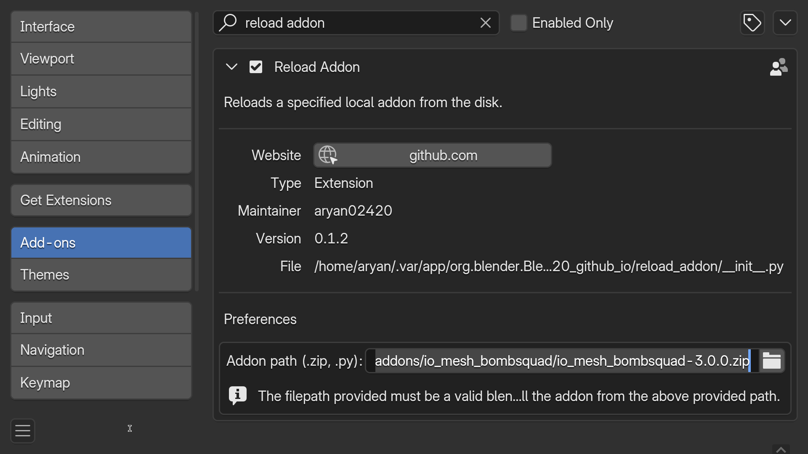

# Reload Addon

> [!NOTE]
> This addon is can be installed from the [self hosted extensions registry](../README.md#installation).

This add-on adds a new operator for reloading a local addon from the disk. You can access it from the Search Menu (<kbd>F3</kbd> OR <kbd>Spacebar</kbd>) and searching for "Reload Addon".


You can also invoke it programmatically using the following code:

```python
bpy.ops.script.reload_addon()
```

This add-on is useful when you are creating an addon which is not in the blender scripts directory, in which case "Reload Scripts" operator won't reload your addon.

Since blender 4.2, installing .zip addons unzips and copies them into an internal directory that blender controls. You may not feel comfortable working witohut source control in a directory you do not control. So the dumb, fool-proof way to run the addon with the latest changes is to reinstall it form the disk.

You can provide a path to the local addon (.py or .zip) in the preferences of this addon. When you invoke "Reload Addon", your local addon will simply be reinstalled.

