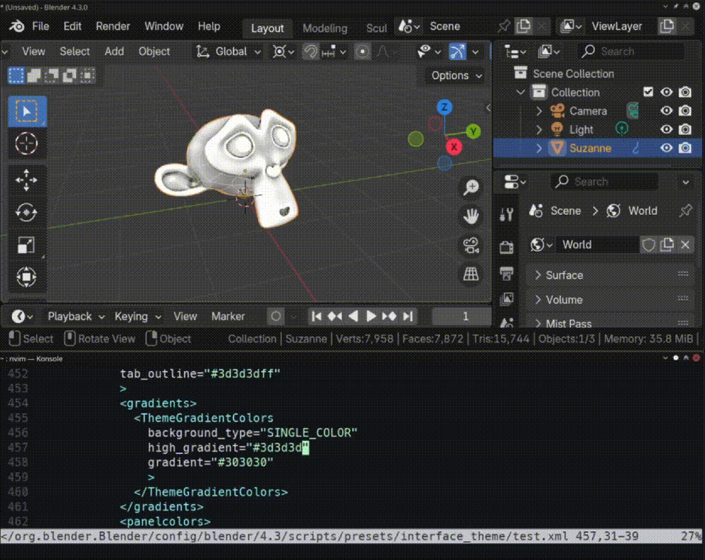

# Reload Theme

[Download](https://extensions.blender.org/add-ons/reload-theme/)

This add-on adds a new operator for reloading the current theme. You can access it from the Search Menu (<kbd>F3</kbd> OR <kbd>Spacebar</kbd>) and searching for "Reload Theme".


You can also invoke it programmatically using the following code:

```python
bpy.ops.script.reload_theme()
```

This add-on is useful when you are creating a custom theme without using the blender interface. It allows you to reload the theme without restarting Blender.


